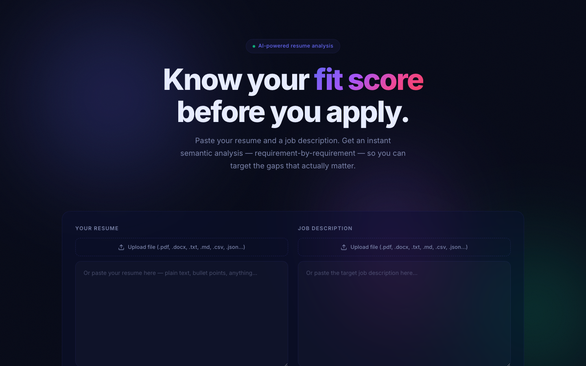
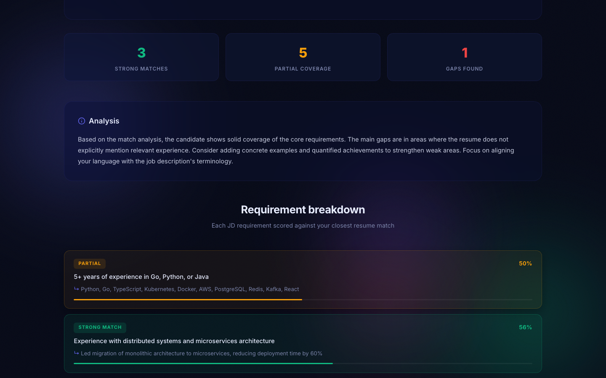
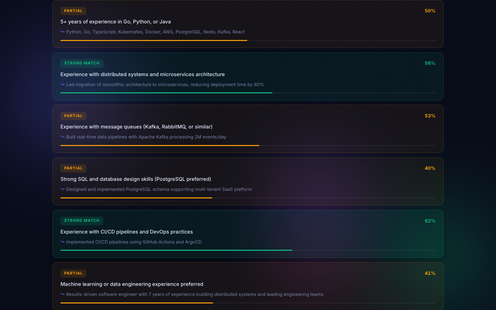
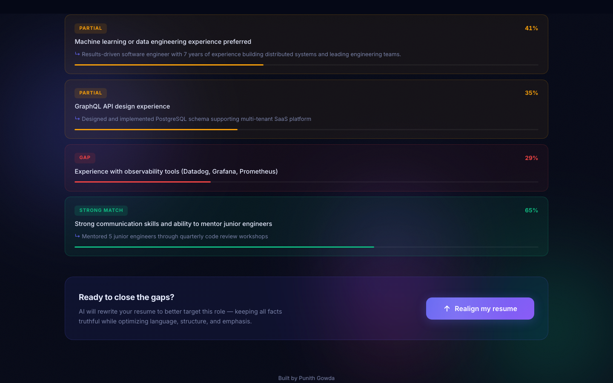

# jobfit-ai — Resume ↔ Job description fit analyzer

[](https://jobfit-ai-tau.vercel.app)
[](https://github.com/filmy-munky/jobfit-ai)

> **[Try it live](https://jobfit-ai-tau.vercel.app)** — no sign-up required, runs in your browser.



Paste a resume and a job description. Get back:

- A **fit score** (0–100) based on semantic similarity between resume and JD
- A **skill-by-skill breakdown** — which JD requirements the resume covers well,
  which are weakly covered, and which are missing
- A narrative **gap analysis** with concrete, actionable suggestions
- **Rewritten bullet points** tailored to the JD's language (optional, uses LLM)

Built as a Next.js 14 (App Router) full-stack TypeScript app. Embeddings run locally
in Node via `@xenova/transformers` (ONNX runtime) — no embedding API required. The
narrative and bullet rewrites use a pluggable LLM provider with an offline fallback.

## Why

Applying to jobs is information asymmetric: recruiters skim, ATS filters miss
signal, and most candidates tailor their resume to a JD using vibes. jobfit-ai makes
the match objective, shows you exactly where the gaps are, and helps you close them
in the language the hiring team actually used.

## Features

- **Local embeddings** — `Xenova/all-MiniLM-L6-v2` via ONNX runtime. First request
  downloads ~25MB; subsequent requests are ~50ms per embedding.
- **Requirement extraction** — parses a JD into atomic requirement statements
  (skills, responsibilities, qualifications) with a small heuristic pipeline that
  works without an LLM, and can be upgraded to LLM extraction when one is configured.
- **Per-requirement scoring** — each requirement is embedded and matched against the
  closest resume sentence; coverage is color-coded (strong / weak / missing).
- **Pluggable LLM** — `anthropic`, `openai`, `ollama`, or `mock` (deterministic
  templated output for offline runs).
- **Streaming UI** — narrative and rewrites stream in as the model emits them.

## Screenshots

| Analysis Results | Requirement Breakdown |
|---|---|
|  |  |

| Resume Realignment |
|---|
|  |

## Quick start

```bash
npm install
npm run dev
# -> http://localhost:3000
```

The first `/api/analyze` call downloads the embedding model (~25MB). This is cached
in `./.cache` and reused on subsequent runs.

### Providers

Set one environment variable:

```bash
# Offline default — templated narrative, no API
# (nothing needed)

# Anthropic
export JOBFIT_PROVIDER=anthropic
export ANTHROPIC_API_KEY=sk-ant-...

# OpenAI
export JOBFIT_PROVIDER=openai
export OPENAI_API_KEY=sk-...

# Local Ollama
export JOBFIT_PROVIDER=ollama
export OLLAMA_MODEL=llama3.1
```

## How it works

```
┌─────────┐   ┌──────────────┐   ┌────────────┐
│ Resume  │──▶│ Sentence     │──▶│ Embeddings │
└─────────┘   │ splitter     │   │ (MiniLM)   │
              └──────────────┘   └─────┬──────┘
                                       │
┌─────────┐   ┌──────────────┐         ▼
│   JD    │──▶│ Requirement  │──▶ per-req nearest-neighbor
└─────────┘   │ extractor    │    cosine similarity
              └──────────────┘
                                       │
                                       ▼
                               ┌────────────────┐
                               │ Score + gaps   │──▶ LLM (optional)
                               └────────────────┘        │
                                                         ▼
                                                 Rewritten bullets
```

## Layout

```
jobfit-ai/
├── app/
│   ├── layout.tsx
│   ├── page.tsx               # Main form + results view
│   ├── globals.css
│   └── api/
│       ├── analyze/route.ts   # POST: returns score + gap analysis
│       └── rewrite/route.ts   # POST: streams rewritten bullet points
├── lib/
│   ├── embeddings.ts          # @xenova/transformers wrapper
│   ├── extract.ts             # JD requirement extraction
│   ├── sentences.ts           # Sentence segmentation
│   ├── analyze.ts             # Scoring pipeline
│   └── providers.ts           # LLM provider abstraction
├── package.json
├── tsconfig.json
└── next.config.mjs
```

## Full feature list

- **File upload**: Drag-and-drop or click to upload `.pdf`, `.docx`, `.txt`, `.md`, `.csv`, `.json`, or any text file
- **Paste input**: Alternatively paste text directly into either field
- **Resume validation**: Detects if input is actually a resume; rejects random text
- **Semantic scoring**: Per-requirement match via local ONNX embeddings
- **Gap analysis narrative**: LLM-generated coaching on what to fix
- **Resume realignment**: AI rewrites your resume targeting the gaps (streams in real-time)
- **Editable output**: Tweak the rewritten resume before validating
- **Re-validation**: Automatically re-scores the improved resume, shows before/after comparison
- **PDF export**: Download a well-structured, professionally formatted resume as `.pdf`

## Roadmap

- ATS compatibility check (flag non-standard section headers, bad dates, tables)
- Cover letter generator seeded by the gap analysis
- Multi-language support

## Author

**Punith Gowda**

## License

MIT
